# User Manual

## Introduction

This app was created to give users a place where they can collaborate with learning new vocabulary words. After a user is registered he/she may create vocabulary quizzes for other users to take or practice with quizzes created by other users. The user may also remove quizzes that he/she created and view various statistics for the quizzes including their latest score on a particular as well as their highest score and the first three users to achieve 100% on that quiz.

## Login

When a user opens the app he/she is presented with the following login screen.

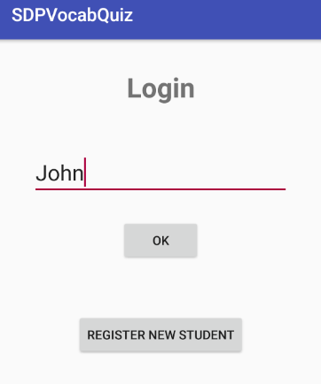

The user enters his/her username and clicks *OK*. The system will validate that the username entered exits. If it does not the system returns an error stating that the username does not exist and the user may try again. If the username exits in the database the user is logged into the system and the main menu is displayed.

## Register New User

If the user does not yet have an account with the app he/she may press *register new user* which displays the following screen.

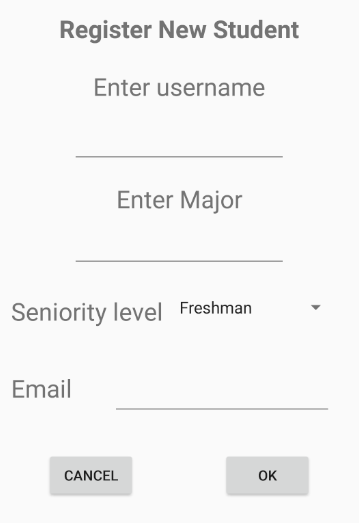

This is the register new user form where the user enters his/her username, major, seniority level and email. After filling out the form and hitting *OK* the user may now login with the username that he/she provided and he/she will be redirected to the main menu.

## Main Menu

The main menu is where the user chooses which operation he/she wished to do; *add quiz, remove quiz, practice quiz, and view statistics*. When the users clicks on one of the options he/she will be redirected to the appropriate form for that option. The user may also click *exit* to logout and exit the app.

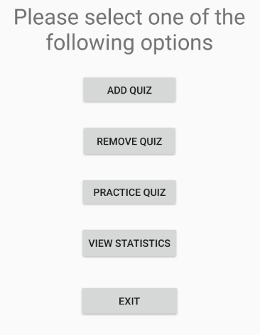

## Add Quiz

If the user clicks *Add Quiz* in the main menu the following screen is displayed.

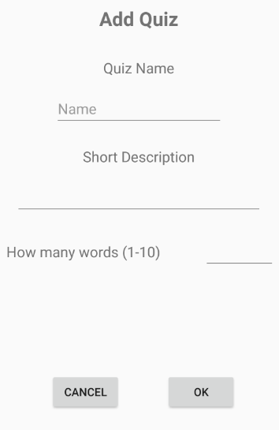

In this form the user must enter a name for the quiz that he/she wishes to create, a short description of the quiz and how many words will be in the quiz (from 1 to 10 words). After filling out the form the user then clicks *OK* and the system will validate that all fields will filled out and that the number entered for the number of words in the quiz is a valid number from 1 to 10. If a field is blank or the number is not within the given range the system will return and error message directing the user to the problem that need to be corrected. Once the form validates the following form is displayed. The user may click *cancel* at any time in which case the system will return to the main menu.     .

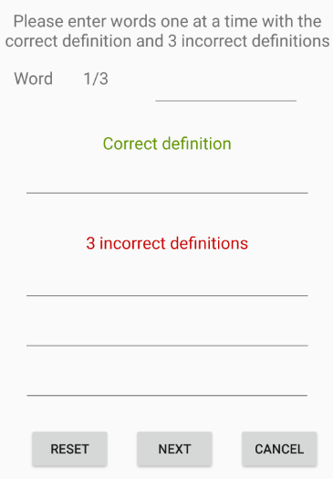

The user must enter each word one by one with the correct definition for that word and three incorrect definitions. The user may click *reset* to clear the fields on the form if they wish to start over for the current word, click *cancel* which will return them to the previous Add Quiz form or click *Next* to continue to the next word in the quiz. This forms repeats the number of times the user entered in the Add Quiz form for how many words are in the quiz. The user will then be returned to the main menu where he/she may make another selection.

## Remove Quiz

If the user clicks Remove Quiz in the main menu the following screen is displayed.

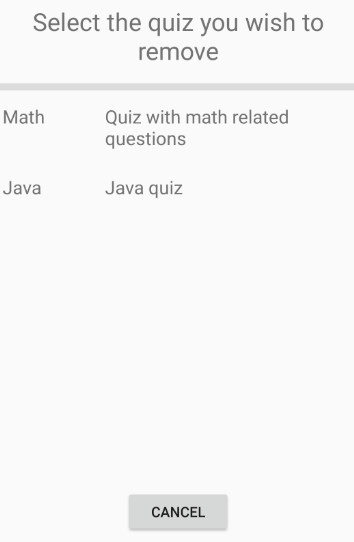

This screen will display a list of all the quizzes created by the current user. The user may click *cancel* which will return to the main menu or *remove* to remove the selected quiz. Upon clicking *remove* the user will be prompted to confirm the deletion as shown in the image below. The user may click *cancel* to return without removing the quiz or *confirm* to delete the quiz. The user will then be returned to the main menu.

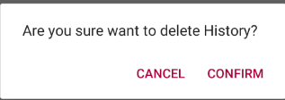

## Practice Quiz

If the user clicks Practice Quiz in the main menu the following screen is displayed.

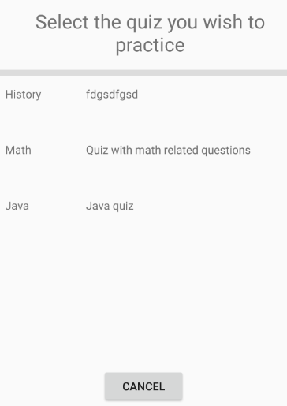

This screen will display all the quizzes created by all users other than the current user. The user may then click *cancel* to return to the main menu or select a quiz to practice by tapping on it. If the user selects a quiz to practice the following confirmation screen is shown.

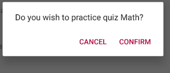

The user may hit *Cancel* if he/she wishes to make a different selection or *confirm* in which case the following form is displayed.

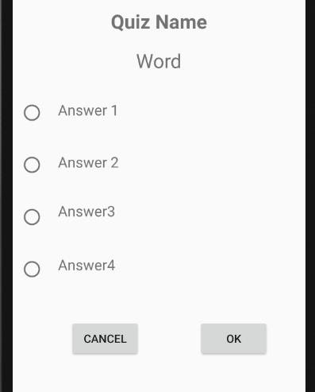

In this form the user is shown a random word from the quiz followed by 4 definitions, only one of which is correct. The user selects one of the definitions by clicking on the radio button adjacent to it and then clicking *OK* to check answer. The system will valid that a definition has been selected then show if the selected definition was correct or incorrect. If no option was selected the system will return an error asking you user to make a selection before hitting *OK*. This process repeats until all words in the quiz have been used at which point the system will display the percentage of correct answers for that quiz. The user may click *cancel* at any time to return to the practice quiz screen to select another quiz. 

## View Statistics

If the user clicks View Statistics in the main menu the following screen is displayed.

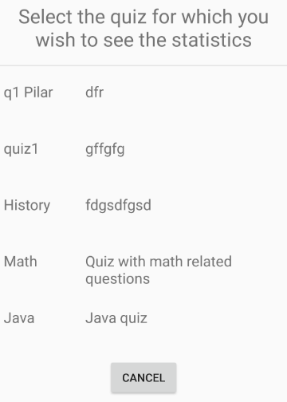

This screen list all quizzes, ordered based on when they were last played by the student (most recent first). The user may click *cancel* to return to the main menu or select a quiz to view the statistics for that particular quiz. The following screen then appears. 

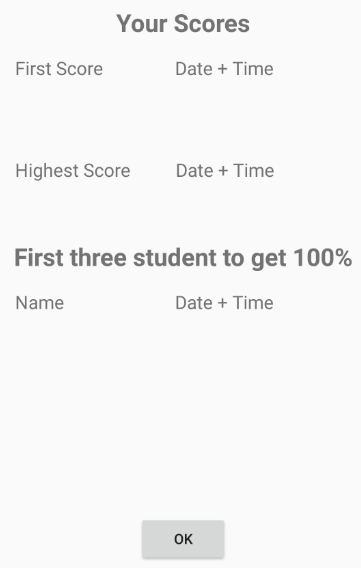

This screen displays the student’s first score and when it was achieved (date and time), the student’s highest score and when it was achieved (date and time), and the names of the first three students to score 100% on that quiz, ordered alphabetically. When finished the user may click *OK* to return to the previous screen to choose another quiz.

## Terminating Session/Logout

Whenever the user is done he/she may click *exit* from the main menu to logout and exit from the system. Clicking *Cancel* will return the user to the main menu if he/she is not already there. The user may reenter any time they desire by opening the app and logging in with his/her username.

