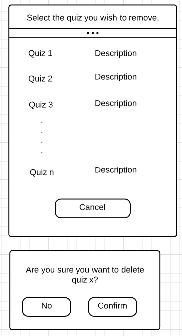

# Design Document

Version 2

**Author**: Liangkai Hu

## 1 Design Considerations

### 1.1 Assumptions

- The APP is created to help students learn English vocabulary interactively. It promotes a competitive learning environment by allowing students to challenge each other with quizzes created by fellow students. Students will be able to not only view their own performance on all quizzes, but also view the top scores achieved by other students in each quiz.

- The APP will be installed on an Android tablet and run locally. It will allow only one user to logon and use at a time. As a result, the design of this APP can be simplified by disregarding issues revolving around multiple users, multiple devices and communications among devices. 

- The data of this APP will persist even when the APP is not running. This means that data need to be stored in storage and will be fetched into memory at runtime. 

- Student does not need a password to logon, only username is required.

- The APP will support minimum Android SDK 6.0.

### 1.2 Constraints

- The UX must be responsive. This implies that the data need to be stored and fetched efficiently.

- Statistics of all students and quizzes are required. This implies statistics need to be updated after each quiz is created, taken or deleted. 

- Words in a quiz can not be repeated. This means a quiz session must keep track of which words have been used, which have not.

### 1.3 System Environment

- The APP will operate on an Android tablet with minimum SDK 6.0.

## 2 Architectural Design

### 2.1 Component Diagram

- The system consists of seven major components, namely User & user management, Quiz, UX, PracticeSession, Quiz Statistics, Database Interface and Database. Each component either provides services through interface or uses services provided by other components, or both. The only service the UI provides is "Interact", which allows a user to interact with the other components of the system in order to use functions provided by them. In the meanwhile, UI provides those functions by consuming the services provided by other components. For example, when a user wants to take a quiz, UI requests the "Practice" service through its interafce with PracticeSession, which in term prepares questions and updates stats by requesting corresponding services provided by "Quiz" and "Quiz Statistics" component. Database Interface provides persistence service for User Management, Quiz Statistics and Quiz. It provides an interface to allow the three components to store their data into Android database.

### 2.2 Deployment Diagram

Deployment diagram shows the physical location of each component. Since the APP will entirely lie on a single Android tablet, all components mentioned above will be on the same device. In this case, deployment diagram is unnecessary. 

## 3 Low-Level Design

### 3.1 Class Diagram

### 3.2 Other Diagrams

We included sequence diagrams to better help show the activities at a lower level to have a clearer picture of the step by step process.
The following are two diagrams. The first showing the sequence of events related to the login of a user and the second showing the sequence of events for the creation of a new student.

Next is a diagram showing the sequence for adding a new quiz.

Next is the sequence diagram for removing a quiz

The following diagram shows the sequence of events for practicing quizzes

Finally the next sequence diagram show the events for viewing the statistics

## 4 User Interface Design

The following image shows the UI for login and the UI for the creation of a new student. If user inputs invalid username an error is shown and the user has to reenter the username.

Upon successful login the system show the main menu as shown below.

If the user selects Add Quiz the system will display the following UI. First the UI to the left is displayed where the user inputs the name of the quiz, a short description, and how many words are in the quiz (1-10). If the input is invalid an error is shown and the system will await new input from the user. If the input is valid the UI on the right is displayed where the user inputs the words with a correct definition and 3 incorrect definitions.

If the user selects Remove Quiz the following UI is shown with a list of all quizzes created by the current user and the option to remove. If remove is clicked for a quiz the popup below appears to confirm that the user wants to remove that quiz.

 

If the user selects Practice quiz the following UI below on the left is shown. It contains a list of all quizzes created by other users. If the current user clicks select on of the quizzes the UI on the right is display with a randomly selected word from the list, the correct definition and 3 randomly chosen incorrect definitions. After the user chooses a definition the system displays if it is correct of not. This repeats until all the words in the quiz have been used at which point the system displays the score for that quiz.

If the user select View statistics the UI below on the right is displayed. It contains a list of all quizzes. If the user selects a quiz the UI on the right is displayed with the current user's score for the first time he/she took the quiz, his/her highest score, and the first three student to get 100% on that quiz.

